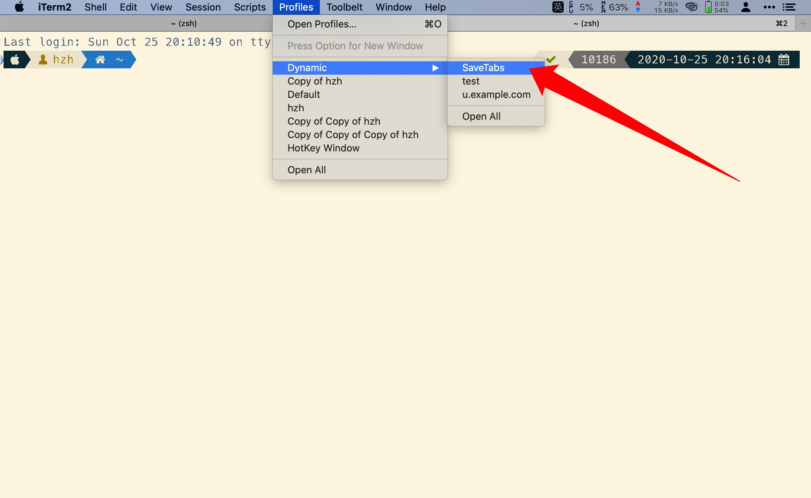

# iTerm2-Workspace

A iTerm2 Profiles which can save the current tab's url to the applescript file.




## Install

To install it simply do following from your terminal:

```bash
git clone --depth=1 https://github.com/hzh-cocong/iTerm2-Workspace.git ~/.iTerm2-Workspace
sh ~/.iterm2_workspace/install.sh
```


## Other Tool

You can search the file by Alfred Workflow *[http://www.packal.org/workflow/iterm2-workspace](http://www.packal.org/workflow/iterm2-workspace)*，download from [here](https://github.com/hzh-cocong/iTerm2-Workspace/releases/download/v1.0.0/iTerm2.Workspace.alfredworkflow).

